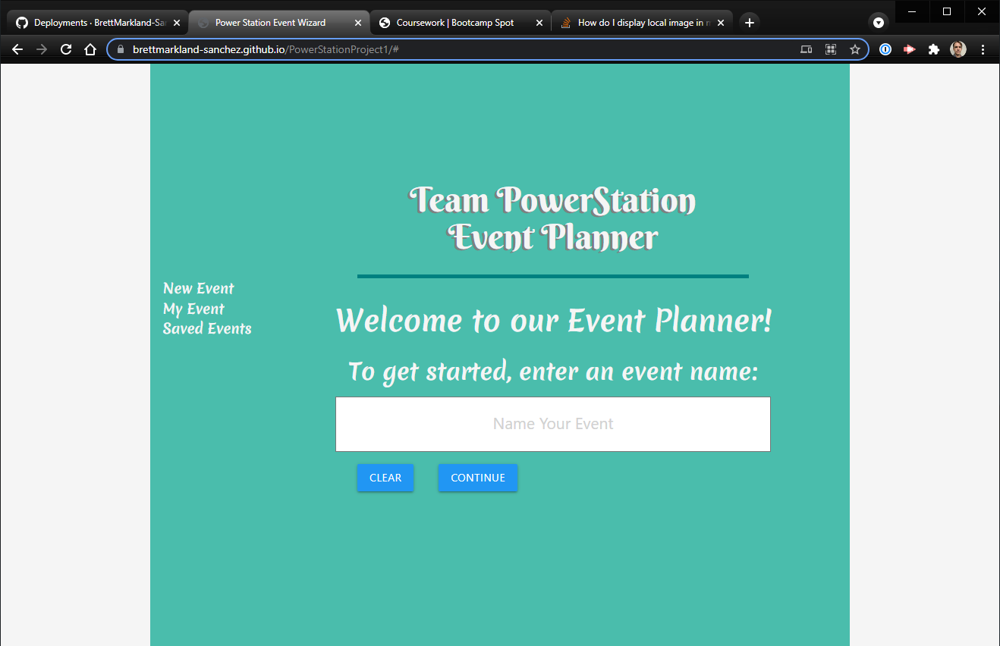
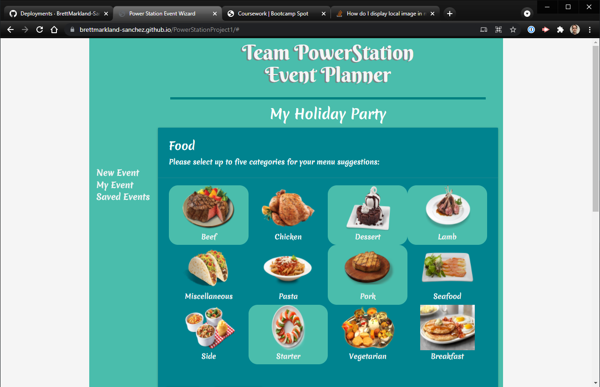
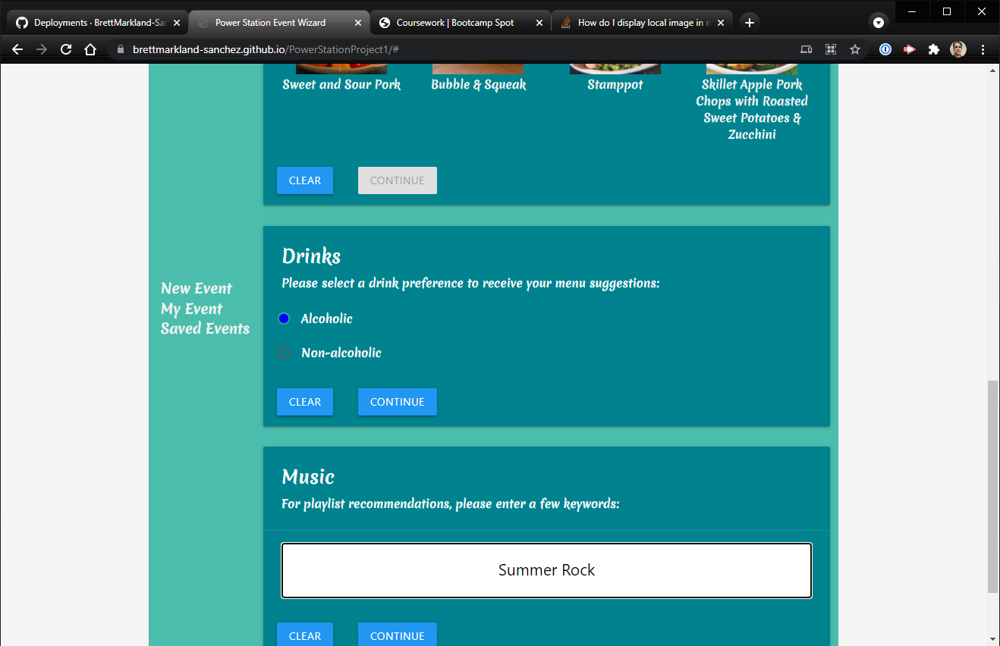
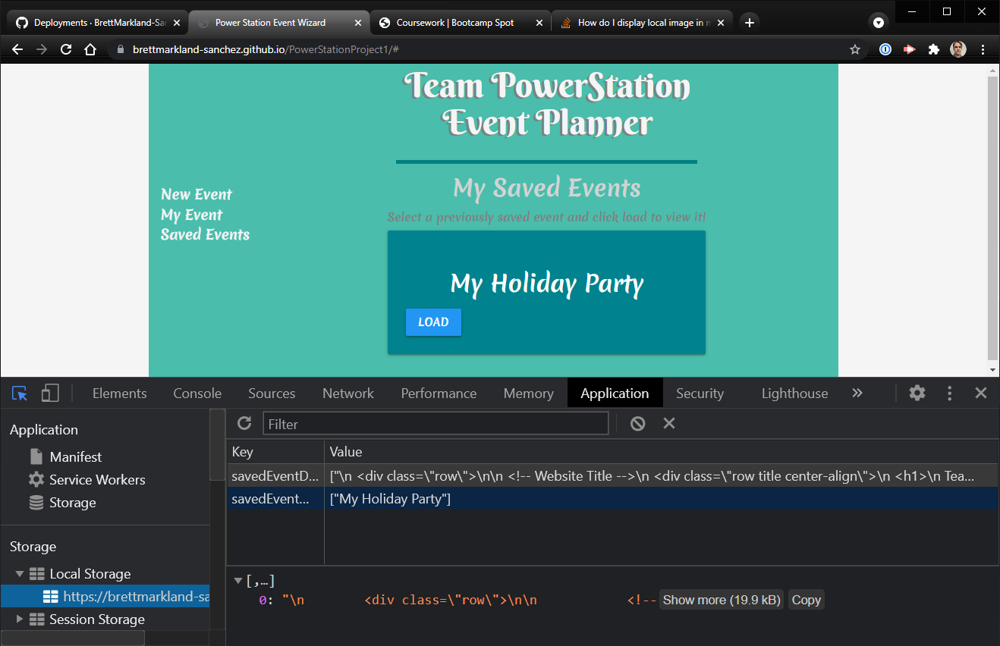
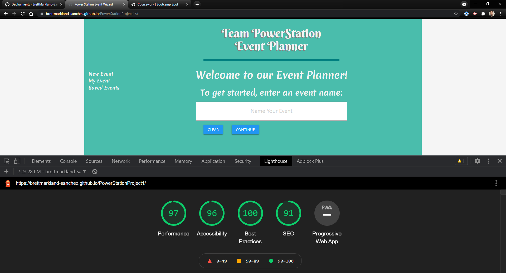

# Team PowerStation Event Planner
Group repo for Coding Boot Camp Project1

#### GitHub Repository: https://github.com/BrettMarkland-Sanchez/PowerStationProject1
#### Deployed Site: https://brettmarkland-sanchez.github.io/PowerStationProject1/
#### Trello Board: https://trello.com/b/7c6ilExZ/team-power-station-coding-project-1
#### Materialize CSS: https://materializecss.com/
## Concept:
```
Using our event planner makes planning the basics a bit easier.
Upon visiting the site, there is an option to select a theme.
Each theme will give the visitor options for drinks, food, and music.
After each of the options have been selected, the event page is displayed.
Users will find they are also able to save their event for later.
```
## Group Members:
**Brett Markland-Sanchez**<br>
**Pete Weigman**<br>
**Virgil Pearson**<br>
**Mason Hames**<br>

## Screenshots:
### Homepage

### My Event

### Selection Cards

### Saved Events

### Lighthouse Scores

